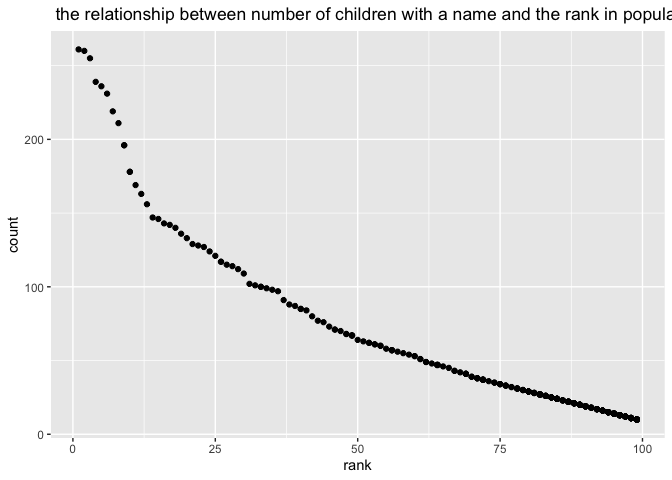

p8105\_hw2\_sl5010
================
Fiona Li
10/2/2021

## Problem 1

``` r
library(tidyverse)
```

    ## ── Attaching packages ─────────────────────────────────────── tidyverse 1.3.1 ──

    ## ✓ ggplot2 3.3.5     ✓ purrr   0.3.4
    ## ✓ tibble  3.1.4     ✓ dplyr   1.0.7
    ## ✓ tidyr   1.1.3     ✓ stringr 1.4.0
    ## ✓ readr   2.0.1     ✓ forcats 0.5.1

    ## ── Conflicts ────────────────────────────────────────── tidyverse_conflicts() ──
    ## x dplyr::filter() masks stats::filter()
    ## x dplyr::lag()    masks stats::lag()

``` r
library(readxl)
```

### Read and clean the Mr. Trash Wheel sheet:

``` r
TrasWheel_df = read_excel("Data/Trash-Wheel-Collection-Totals-7-2020-2.xlsx",range = "A2:N534")

TrasWheel_df = janitor::clean_names(TrasWheel_df)

names(TrasWheel_df)
```

    ##  [1] "dumpster"           "month"              "year"              
    ##  [4] "date"               "weight_tons"        "volume_cubic_yards"
    ##  [7] "plastic_bottles"    "polystyrene"        "cigarette_butts"   
    ## [10] "glass_bottles"      "grocery_bags"       "chip_bags"         
    ## [13] "sports_balls"       "homes_powered"

``` r
TrasWheel_df = filter(TrasWheel_df, !is.na(dumpster)) %>%
mutate(sports_balls = round(sports_balls))
TrasWheel_df
```

    ## # A tibble: 453 × 14
    ##    dumpster month  year date                weight_tons volume_cubic_yards
    ##       <dbl> <chr> <dbl> <dttm>                    <dbl>              <dbl>
    ##  1        1 May    2014 2014-05-16 00:00:00        4.31                 18
    ##  2        2 May    2014 2014-05-16 00:00:00        2.74                 13
    ##  3        3 May    2014 2014-05-16 00:00:00        3.45                 15
    ##  4        4 May    2014 2014-05-17 00:00:00        3.1                  15
    ##  5        5 May    2014 2014-05-17 00:00:00        4.06                 18
    ##  6        6 May    2014 2014-05-20 00:00:00        2.71                 13
    ##  7        7 May    2014 2014-05-21 00:00:00        1.91                  8
    ##  8        8 May    2014 2014-05-28 00:00:00        3.7                  16
    ##  9        9 June   2014 2014-06-05 00:00:00        2.52                 14
    ## 10       10 June   2014 2014-06-11 00:00:00        3.76                 18
    ## # … with 443 more rows, and 8 more variables: plastic_bottles <dbl>,
    ## #   polystyrene <dbl>, cigarette_butts <dbl>, glass_bottles <dbl>,
    ## #   grocery_bags <dbl>, chip_bags <dbl>, sports_balls <dbl>,
    ## #   homes_powered <dbl>

### Read and clean precipitation data for 2018 and 2019

``` r
TrasWheel_df_18 = 
  read_excel("Data/Trash-Wheel-Collection-Totals-7-2020-2.xlsx", 
             sheet = "2018 Precipitation", range = "A2:B14") %>%
  filter(!is.na(Total)) %>%
  mutate(year = 2018)

TrasWheel_df_19= 
  read_excel("Data/Trash-Wheel-Collection-Totals-7-2020-2.xlsx", sheet = "2019 Precipitation", range = "A2:B14") %>%
  filter(!is.na(Total)) %>%
  mutate(year = 2019)

TrasWheel_df_1819 = full_join(TrasWheel_df_18, TrasWheel_df_19) %>%
  mutate(Month = month.name[Month])
```

    ## Joining, by = c("Month", "Total", "year")

``` r
TrasWheel_df_1819
```

    ## # A tibble: 24 × 3
    ##    Month     Total  year
    ##    <chr>     <dbl> <dbl>
    ##  1 January    0.94  2018
    ##  2 February   4.8   2018
    ##  3 March      2.69  2018
    ##  4 April      4.69  2018
    ##  5 May        9.27  2018
    ##  6 June       4.77  2018
    ##  7 July      10.2   2018
    ##  8 August     6.45  2018
    ##  9 September 10.5   2018
    ## 10 October    2.12  2018
    ## # … with 14 more rows

### Write a paragraph about these data

``` r
skimr::skim(TrasWheel_df)
```

|                                                  |               |
|:-------------------------------------------------|:--------------|
| Name                                             | TrasWheel\_df |
| Number of rows                                   | 453           |
| Number of columns                                | 14            |
| \_\_\_\_\_\_\_\_\_\_\_\_\_\_\_\_\_\_\_\_\_\_\_   |               |
| Column type frequency:                           |               |
| character                                        | 1             |
| numeric                                          | 12            |
| POSIXct                                          | 1             |
| \_\_\_\_\_\_\_\_\_\_\_\_\_\_\_\_\_\_\_\_\_\_\_\_ |               |
| Group variables                                  | None          |

Data summary

**Variable type: character**

| skim\_variable | n\_missing | complete\_rate | min | max | empty | n\_unique | whitespace |
|:---------------|-----------:|---------------:|----:|----:|------:|----------:|-----------:|
| month          |          0 |              1 |   3 |   9 |     0 |        13 |          0 |

**Variable type: numeric**

| skim\_variable       | n\_missing | complete\_rate |     mean |       sd |      p0 |     p25 |      p50 |      p75 |      p100 | hist  |
|:---------------------|-----------:|---------------:|---------:|---------:|--------:|--------:|---------:|---------:|----------:|:------|
| dumpster             |          0 |              1 |   227.00 |   130.91 |    1.00 |  114.00 |   227.00 |   340.00 |    453.00 | ▇▇▇▇▇ |
| year                 |          0 |              1 |  2017.26 |     1.95 | 2014.00 | 2015.00 |  2018.00 |  2019.00 |   2021.00 | ▆▃▇▃▃ |
| weight\_tons         |          0 |              1 |     3.20 |     0.73 |    0.78 |    2.72 |     3.19 |     3.68 |      5.62 | ▁▃▇▃▁ |
| volume\_cubic\_yards |          0 |              1 |    15.41 |     1.48 |    7.00 |   15.00 |    15.00 |    15.00 |     20.00 | ▁▁▁▇▂ |
| plastic\_bottles     |          0 |              1 |  1898.93 |  1027.78 |  210.00 |  980.00 |  1850.00 |  2640.00 |   5960.00 | ▇▇▅▁▁ |
| polystyrene          |          0 |              1 |  1920.92 |  1161.89 |  210.00 |  950.00 |  1650.00 |  2730.00 |   6540.00 | ▇▅▃▁▁ |
| cigarette\_butts     |          0 |              1 | 24521.68 | 32047.72 |  980.00 | 5000.00 | 11000.00 | 32000.00 | 310000.00 | ▇▁▁▁▁ |
| glass\_bottles       |          0 |              1 |    22.45 |    17.44 |    0.00 |    9.00 |    18.00 |    32.00 |    110.00 | ▇▃▂▁▁ |
| grocery\_bags        |          0 |              1 |  1103.82 |   860.26 |   50.00 |  425.00 |   820.00 |  1620.00 |   3750.00 | ▇▅▂▂▁ |
| chip\_bags           |          0 |              1 |  1558.40 |   946.59 |  180.00 |  800.00 |  1327.00 |  2150.00 |   5085.00 | ▇▆▃▁▁ |
| sports\_balls        |          0 |              1 |    11.75 |     9.18 |    0.00 |    5.00 |     9.00 |    16.00 |     56.00 | ▇▃▁▁▁ |
| homes\_powered       |          0 |              1 |    45.32 |    21.71 |    0.00 |   38.83 |    51.17 |    58.67 |     93.67 | ▃▂▇▅▁ |

**Variable type: POSIXct**

| skim\_variable | n\_missing | complete\_rate | min        | max        | median     | n\_unique |
|:---------------|-----------:|---------------:|:-----------|:-----------|:-----------|----------:|
| date           |          0 |              1 | 1900-01-20 | 2021-01-04 | 2018-02-05 |       275 |

``` r
skimr::skim(TrasWheel_df_1819)
```

|                                                  |                     |
|:-------------------------------------------------|:--------------------|
| Name                                             | TrasWheel\_df\_1819 |
| Number of rows                                   | 24                  |
| Number of columns                                | 3                   |
| \_\_\_\_\_\_\_\_\_\_\_\_\_\_\_\_\_\_\_\_\_\_\_   |                     |
| Column type frequency:                           |                     |
| character                                        | 1                   |
| numeric                                          | 2                   |
| \_\_\_\_\_\_\_\_\_\_\_\_\_\_\_\_\_\_\_\_\_\_\_\_ |                     |
| Group variables                                  | None                |

Data summary

**Variable type: character**

| skim\_variable | n\_missing | complete\_rate | min | max | empty | n\_unique | whitespace |
|:---------------|-----------:|---------------:|----:|----:|------:|----------:|-----------:|
| Month          |          0 |              1 |   3 |   9 |     0 |        12 |          0 |

**Variable type: numeric**

| skim\_variable | n\_missing | complete\_rate |    mean |   sd |      p0 |     p25 |     p50 |     p75 |    p100 | hist  |
|:---------------|-----------:|---------------:|--------:|-----:|--------:|--------:|--------:|--------:|--------:|:------|
| Total          |          0 |              1 |    4.34 | 2.88 |    0.16 |    2.32 |    3.74 |    5.62 |   10.47 | ▇▇▇▂▃ |
| year           |          0 |              1 | 2018.50 | 0.51 | 2018.00 | 2018.00 | 2018.50 | 2019.00 | 2019.00 | ▇▁▁▁▇ |

``` r
median =
  filter(TrasWheel_df, year == 2019)%>%
  pull(sports_balls)%>%
  median()
median
```

    ## [1] 9

the number of observations in TrasWheel\_df dataset is 453, and that in
TrasWheel\_df\_1819 is 24. Key variables of TrasWheel\_df is
sports\_balls, and key variables of TrasWheel\_df\_1819 is Total. For
available data, the total precipitation in 2018 is 70.33, and the median
number of sports balls in a dumpster in 2019 is 9.

## Problem 2

### clean the data in pols-month.csv.

``` r
pols_month_df = 
  read.csv(file = "./data/pols-month.csv") %>%
  separate(mon, into = c("year", "month", "day"), sep ="-") %>%
  mutate(month = as.numeric(month)) %>%
  mutate(month = month.name[month]) %>%
  select(-day) %>%
  rename(republic = prez_gop, democratic = prez_dem) %>%
  pivot_longer(
    c(republic,democratic),
    names_to = "president", 
    values_to = "number") %>%
  mutate(year = as.numeric(year)) %>%
  filter(number != 0) %>%
  select(-number) 
pols_month_df
```

    ## # A tibble: 822 × 9
    ##     year month     gov_gop sen_gop rep_gop gov_dem sen_dem rep_dem president 
    ##    <dbl> <chr>       <int>   <int>   <int>   <int>   <int>   <int> <chr>     
    ##  1  1947 January        23      51     253      23      45     198 democratic
    ##  2  1947 February       23      51     253      23      45     198 democratic
    ##  3  1947 March          23      51     253      23      45     198 democratic
    ##  4  1947 April          23      51     253      23      45     198 democratic
    ##  5  1947 May            23      51     253      23      45     198 democratic
    ##  6  1947 June           23      51     253      23      45     198 democratic
    ##  7  1947 July           23      51     253      23      45     198 democratic
    ##  8  1947 August         23      51     253      23      45     198 democratic
    ##  9  1947 September      23      51     253      23      45     198 democratic
    ## 10  1947 October        23      51     253      23      45     198 democratic
    ## # … with 812 more rows

### Second, clean the data in snp.csv using a similar process to the above.

``` r
snp_df = 
  read.csv(file = "./data/snp.csv") %>%
  separate(date, into = c("month", "day", "year"), sep ="/")%>%
  mutate(month = as.numeric(month)) %>%
  mutate(month = month.name[month]) %>%
  select(-day) %>%
  mutate(year = as.numeric(year))
  for (i in 1: nrow(snp_df)){
    if (snp_df$year[i] > 15) {snp_df$year[i] = snp_df$year[i]+1900}
    else {snp_df$year[i] = snp_df$year[i]+2000}
  }
snp_df = arrange(snp_df, year)
snp_df  
```

    ##         month year   close
    ## 1    December 1950   20.43
    ## 2    November 1950   19.51
    ## 3     October 1950   19.53
    ## 4   September 1950   19.45
    ## 5      August 1950   18.42
    ## 6        July 1950   17.84
    ## 7        June 1950   17.69
    ## 8         May 1950   18.78
    ## 9       April 1950   17.96
    ## 10      March 1950   17.29
    ## 11   February 1950   17.22
    ## 12    January 1950   17.05
    ## 13   December 1951   23.77
    ## 14   November 1951   22.88
    ## 15    October 1951   22.94
    ## 16  September 1951   23.26
    ## 17     August 1951   23.28
    ## 18       July 1951   22.40
    ## 19       June 1951   20.96
    ## 20        May 1951   21.52
    ## 21      April 1951   22.43
    ## 22      March 1951   21.48
    ## 23   February 1951   21.80
    ## 24    January 1951   21.66
    ## 25   December 1952   26.57
    ## 26   November 1952   25.66
    ## 27    October 1952   24.52
    ## 28  September 1952   24.54
    ## 29     August 1952   25.03
    ## 30       July 1952   25.40
    ## 31       June 1952   24.96
    ## 32        May 1952   23.86
    ## 33      April 1952   23.32
    ## 34      March 1952   24.37
    ## 35   February 1952   23.26
    ## 36    January 1952   24.14
    ## 37   December 1953   24.81
    ## 38   November 1953   24.76
    ## 39    October 1953   24.54
    ## 40  September 1953   23.35
    ## 41     August 1953   23.32
    ## 42       July 1953   24.75
    ## 43       June 1953   24.14
    ## 44        May 1953   24.54
    ## 45      April 1953   24.62
    ## 46      March 1953   25.29
    ## 47   February 1953   25.90
    ## 48    January 1953   26.38
    ## 49   December 1954   35.98
    ## 50   November 1954   34.24
    ## 51    October 1954   31.68
    ## 52  September 1954   32.31
    ## 53     August 1954   29.83
    ## 54       July 1954   30.88
    ## 55       June 1954   29.21
    ## 56        May 1954   29.19
    ## 57      April 1954   28.26
    ## 58      March 1954   26.94
    ## 59   February 1954   26.15
    ## 60    January 1954   26.08
    ## 61   December 1955   45.48
    ## 62   November 1955   45.51
    ## 63    October 1955   42.34
    ## 64  September 1955   43.67
    ## 65     August 1955   43.18
    ## 66       July 1955   43.52
    ## 67       June 1955   41.03
    ## 68        May 1955   37.91
    ## 69      April 1955   37.96
    ## 70      March 1955   36.58
    ## 71   February 1955   36.76
    ## 72    January 1955   36.63
    ## 73   December 1956   46.67
    ## 74   November 1956   45.08
    ## 75    October 1956   45.58
    ## 76  September 1956   45.35
    ## 77     August 1956   47.51
    ## 78       July 1956   49.39
    ## 79       June 1956   46.97
    ## 80        May 1956   45.20
    ## 81      April 1956   48.38
    ## 82      March 1956   48.48
    ## 83   February 1956   45.34
    ## 84    January 1956   43.82
    ## 85   December 1957   39.99
    ## 86   November 1957   41.72
    ## 87    October 1957   41.06
    ## 88  September 1957   42.42
    ## 89     August 1957   45.22
    ## 90       July 1957   47.91
    ## 91       June 1957   47.37
    ## 92        May 1957   47.43
    ## 93      April 1957   45.74
    ## 94      March 1957   44.11
    ## 95   February 1957   43.26
    ## 96    January 1957   44.72
    ## 97   December 1958   55.21
    ## 98   November 1958   52.48
    ## 99    October 1958   51.33
    ## 100 September 1958   50.06
    ## 101    August 1958   47.75
    ## 102      July 1958   47.19
    ## 103      June 1958   45.24
    ## 104       May 1958   44.09
    ## 105     April 1958   43.44
    ## 106     March 1958   42.10
    ## 107  February 1958   40.84
    ## 108   January 1958   41.70
    ## 109  December 1959   59.89
    ## 110  November 1959   58.28
    ## 111   October 1959   57.52
    ## 112 September 1959   56.88
    ## 113    August 1959   59.60
    ## 114      July 1959   60.51
    ## 115      June 1959   58.47
    ## 116       May 1959   58.68
    ## 117     April 1959   57.59
    ## 118     March 1959   55.44
    ## 119  February 1959   55.41
    ## 120   January 1959   55.45
    ## 121  December 1960   58.11
    ## 122  November 1960   55.54
    ## 123   October 1960   53.39
    ## 124 September 1960   53.52
    ## 125    August 1960   56.96
    ## 126      July 1960   55.51
    ## 127      June 1960   56.92
    ## 128       May 1960   55.83
    ## 129     April 1960   54.37
    ## 130     March 1960   55.34
    ## 131  February 1960   56.12
    ## 132   January 1960   55.61
    ## 133  December 1961   71.55
    ## 134  November 1961   71.32
    ## 135   October 1961   68.62
    ## 136 September 1961   66.73
    ## 137    August 1961   68.07
    ## 138      July 1961   66.76
    ## 139      June 1961   64.64
    ## 140       May 1961   66.56
    ## 141     April 1961   65.31
    ## 142     March 1961   65.06
    ## 143  February 1961   63.44
    ## 144   January 1961   61.78
    ## 145  December 1962   63.10
    ## 146  November 1962   62.26
    ## 147   October 1962   56.52
    ## 148 September 1962   56.27
    ## 149    August 1962   59.12
    ## 150      July 1962   58.23
    ## 151      June 1962   54.75
    ## 152       May 1962   59.63
    ## 153     April 1962   65.24
    ## 154     March 1962   69.55
    ## 155  February 1962   69.96
    ## 156   January 1962   68.84
    ## 157  December 1963   75.02
    ## 158  November 1963   73.23
    ## 159   October 1963   74.01
    ## 160 September 1963   71.70
    ## 161    August 1963   72.50
    ## 162      July 1963   69.13
    ## 163      June 1963   69.37
    ## 164       May 1963   70.80
    ## 165     April 1963   69.80
    ## 166     March 1963   66.57
    ## 167  February 1963   64.29
    ## 168   January 1963   66.20
    ## 169  December 1964   84.75
    ## 170  November 1964   84.42
    ## 171   October 1964   84.86
    ## 172 September 1964   84.18
    ## 173    August 1964   81.83
    ## 174      July 1964   83.18
    ## 175      June 1964   81.69
    ## 176       May 1964   80.37
    ## 177     April 1964   79.46
    ## 178     March 1964   78.98
    ## 179  February 1964   77.80
    ## 180   January 1964   77.04
    ## 181  December 1965   92.43
    ## 182  November 1965   91.61
    ## 183   October 1965   92.42
    ## 184 September 1965   89.96
    ## 185    August 1965   87.17
    ## 186      July 1965   85.25
    ## 187      June 1965   84.12
    ## 188       May 1965   88.42
    ## 189     April 1965   89.11
    ## 190     March 1965   86.16
    ## 191  February 1965   87.43
    ## 192   January 1965   87.56
    ## 193  December 1966   80.33
    ## 194  November 1966   80.45
    ## 195   October 1966   80.20
    ## 196 September 1966   76.56
    ## 197    August 1966   77.10
    ## 198      July 1966   83.60
    ## 199      June 1966   84.74
    ## 200       May 1966   86.13
    ## 201     April 1966   91.06
    ## 202     March 1966   89.23
    ## 203  February 1966   91.22
    ## 204   January 1966   92.88
    ## 205  December 1967   96.47
    ## 206  November 1967   94.00
    ## 207   October 1967   93.30
    ## 208 September 1967   96.71
    ## 209    August 1967   93.64
    ## 210      July 1967   94.75
    ## 211      June 1967   90.64
    ## 212       May 1967   89.08
    ## 213     April 1967   94.01
    ## 214     March 1967   90.20
    ## 215  February 1967   86.78
    ## 216   January 1967   86.61
    ## 217  December 1968  103.86
    ## 218  November 1968  108.37
    ## 219   October 1968  103.41
    ## 220 September 1968  102.67
    ## 221    August 1968   98.86
    ## 222      July 1968   97.74
    ## 223      June 1968   99.58
    ## 224       May 1968   98.68
    ## 225     April 1968   97.46
    ## 226     March 1968   90.20
    ## 227  February 1968   89.36
    ## 228   January 1968   92.24
    ## 229  December 1969   92.06
    ## 230  November 1969   93.81
    ## 231   October 1969   97.12
    ## 232 September 1969   93.12
    ## 233    August 1969   95.51
    ## 234      July 1969   91.83
    ## 235      June 1969   97.71
    ## 236       May 1969  103.46
    ## 237     April 1969  103.69
    ## 238     March 1969  101.51
    ## 239  February 1969   98.13
    ## 240   January 1969  103.01
    ## 241  December 1970   92.15
    ## 242  November 1970   87.20
    ## 243   October 1970   83.25
    ## 244 September 1970   84.30
    ## 245    August 1970   81.52
    ## 246      July 1970   78.05
    ## 247      June 1970   72.72
    ## 248       May 1970   76.55
    ## 249     April 1970   81.52
    ## 250     March 1970   89.63
    ## 251  February 1970   89.50
    ## 252   January 1970   85.02
    ## 253  December 1971  102.09
    ## 254  November 1971   93.99
    ## 255   October 1971   94.23
    ## 256 September 1971   98.34
    ## 257    August 1971   99.03
    ## 258      July 1971   95.58
    ## 259      June 1971   98.70
    ## 260       May 1971   99.63
    ## 261     April 1971  103.95
    ## 262     March 1971  100.31
    ## 263  February 1971   96.75
    ## 264   January 1971   95.88
    ## 265  December 1972  118.05
    ## 266  November 1972  116.67
    ## 267   October 1972  111.58
    ## 268 September 1972  110.55
    ## 269    August 1972  111.09
    ## 270      July 1972  107.39
    ## 271      June 1972  107.14
    ## 272       May 1972  109.53
    ## 273     April 1972  107.67
    ## 274     March 1972  107.20
    ## 275  February 1972  106.57
    ## 276   January 1972  103.94
    ## 277  December 1973   97.55
    ## 278  November 1973   95.96
    ## 279   October 1973  108.29
    ## 280 September 1973  108.43
    ## 281    August 1973  104.25
    ## 282      July 1973  108.22
    ## 283      June 1973  104.26
    ## 284       May 1973  104.95
    ## 285     April 1973  106.97
    ## 286     March 1973  111.52
    ## 287  February 1973  111.68
    ## 288   January 1973  116.03
    ## 289  December 1974   68.56
    ## 290  November 1974   69.97
    ## 291   October 1974   73.90
    ## 292 September 1974   63.54
    ## 293    August 1974   72.15
    ## 294      July 1974   79.31
    ## 295      June 1974   86.00
    ## 296       May 1974   87.28
    ## 297     April 1974   90.31
    ## 298     March 1974   93.98
    ## 299  February 1974   96.22
    ## 300   January 1974   96.57
    ## 301  December 1975   90.19
    ## 302  November 1975   91.24
    ## 303   October 1975   89.04
    ## 304 September 1975   83.87
    ## 305    August 1975   86.88
    ## 306      July 1975   88.75
    ## 307      June 1975   95.19
    ## 308       May 1975   91.15
    ## 309     April 1975   87.30
    ## 310     March 1975   83.36
    ## 311  February 1975   81.59
    ## 312   January 1975   76.98
    ## 313  December 1976  107.46
    ## 314  November 1976  102.10
    ## 315   October 1976  102.90
    ## 316 September 1976  105.24
    ## 317    August 1976  102.91
    ## 318      July 1976  103.44
    ## 319      June 1976  104.28
    ## 320       May 1976  100.18
    ## 321     April 1976  101.64
    ## 322     March 1976  102.77
    ## 323  February 1976   99.71
    ## 324   January 1976  100.86
    ## 325  December 1977   95.10
    ## 326  November 1977   94.83
    ## 327   October 1977   92.34
    ## 328 September 1977   96.53
    ## 329    August 1977   96.77
    ## 330      July 1977   98.85
    ## 331      June 1977  100.48
    ## 332       May 1977   96.12
    ## 333     April 1977   98.44
    ## 334     March 1977   98.42
    ## 335  February 1977   99.82
    ## 336   January 1977  102.03
    ## 337  December 1978   96.11
    ## 338  November 1978   94.70
    ## 339   October 1978   93.15
    ## 340 September 1978  102.54
    ## 341    August 1978  103.29
    ## 342      July 1978  100.68
    ## 343      June 1978   95.53
    ## 344       May 1978   97.24
    ## 345     April 1978   96.83
    ## 346     March 1978   89.21
    ## 347  February 1978   87.04
    ## 348   January 1978   89.25
    ## 349  December 1979  107.94
    ## 350  November 1979  106.16
    ## 351   October 1979  101.82
    ## 352 September 1979  109.32
    ## 353    August 1979  109.32
    ## 354      July 1979  103.81
    ## 355      June 1979  102.91
    ## 356       May 1979   99.08
    ## 357     April 1979  101.76
    ## 358     March 1979  101.59
    ## 359  February 1979   96.28
    ## 360   January 1979   99.93
    ## 361  December 1980  135.76
    ## 362  November 1980  140.52
    ## 363   October 1980  127.47
    ## 364 September 1980  125.46
    ## 365    August 1980  122.38
    ## 366      July 1980  121.67
    ## 367      June 1980  114.24
    ## 368       May 1980  111.24
    ## 369     April 1980  106.29
    ## 370     March 1980  102.09
    ## 371  February 1980  113.66
    ## 372   January 1980  114.16
    ## 373  December 1981  122.55
    ## 374  November 1981  126.35
    ## 375   October 1981  121.89
    ## 376 September 1981  116.18
    ## 377    August 1981  122.79
    ## 378      July 1981  130.92
    ## 379      June 1981  131.21
    ## 380       May 1981  132.59
    ## 381     April 1981  132.81
    ## 382     March 1981  136.00
    ## 383  February 1981  131.27
    ## 384   January 1981  129.55
    ## 385  December 1982  140.64
    ## 386  November 1982  138.53
    ## 387   October 1982  133.72
    ## 388 September 1982  120.42
    ## 389    August 1982  119.51
    ## 390      July 1982  107.09
    ## 391      June 1982  109.61
    ## 392       May 1982  111.88
    ## 393     April 1982  116.44
    ## 394     March 1982  111.96
    ## 395  February 1982  113.11
    ## 396   January 1982  120.40
    ## 397  December 1983  164.93
    ## 398  November 1983  166.40
    ## 399   October 1983  163.55
    ## 400 September 1983  166.07
    ## 401    August 1983  164.40
    ## 402      July 1983  162.56
    ## 403      June 1983  167.64
    ## 404       May 1983  162.39
    ## 405     April 1983  164.43
    ## 406     March 1983  152.96
    ## 407  February 1983  148.06
    ## 408   January 1983  145.30
    ## 409  December 1984  167.24
    ## 410  November 1984  163.58
    ## 411   October 1984  166.09
    ## 412 September 1984  166.10
    ## 413    August 1984  166.68
    ## 414      July 1984  150.66
    ## 415      June 1984  153.18
    ## 416       May 1984  150.55
    ## 417     April 1984  160.05
    ## 418     March 1984  159.18
    ## 419  February 1984  157.06
    ## 420   January 1984  163.41
    ## 421  December 1985  211.28
    ## 422  November 1985  202.17
    ## 423   October 1985  189.82
    ## 424 September 1985  182.08
    ## 425    August 1985  188.63
    ## 426      July 1985  190.92
    ## 427      June 1985  191.85
    ## 428       May 1985  189.55
    ## 429     April 1985  179.83
    ## 430     March 1985  180.66
    ## 431  February 1985  181.18
    ## 432   January 1985  179.63
    ## 433  December 1986  242.17
    ## 434  November 1986  249.22
    ## 435   October 1986  243.98
    ## 436 September 1986  231.32
    ## 437    August 1986  252.93
    ## 438      July 1986  236.12
    ## 439      June 1986  250.84
    ## 440       May 1986  247.35
    ## 441     April 1986  235.52
    ## 442     March 1986  238.90
    ## 443  February 1986  226.92
    ## 444   January 1986  211.78
    ## 445  December 1987  247.08
    ## 446  November 1987  230.30
    ## 447   October 1987  251.79
    ## 448 September 1987  321.83
    ## 449    August 1987  329.80
    ## 450      July 1987  318.66
    ## 451      June 1987  304.00
    ## 452       May 1987  290.10
    ## 453     April 1987  288.36
    ## 454     March 1987  291.70
    ## 455  February 1987  284.20
    ## 456   January 1987  274.08
    ## 457  December 1988  277.72
    ## 458  November 1988  273.70
    ## 459   October 1988  278.97
    ## 460 September 1988  271.91
    ## 461    August 1988  261.52
    ## 462      July 1988  272.02
    ## 463      June 1988  273.50
    ## 464       May 1988  262.16
    ## 465     April 1988  261.33
    ## 466     March 1988  258.89
    ## 467  February 1988  267.82
    ## 468   January 1988  257.07
    ## 469  December 1989  353.40
    ## 470  November 1989  345.99
    ## 471   October 1989  340.36
    ## 472 September 1989  349.15
    ## 473    August 1989  351.45
    ## 474      July 1989  346.08
    ## 475      June 1989  317.98
    ## 476       May 1989  320.52
    ## 477     April 1989  309.64
    ## 478     March 1989  294.87
    ## 479  February 1989  288.86
    ## 480   January 1989  297.47
    ## 481  December 1990  330.22
    ## 482  November 1990  322.22
    ## 483   October 1990  304.00
    ## 484 September 1990  306.05
    ## 485    August 1990  322.56
    ## 486      July 1990  356.15
    ## 487      June 1990  358.02
    ## 488       May 1990  361.23
    ## 489     April 1990  330.80
    ## 490     March 1990  339.94
    ## 491  February 1990  331.89
    ## 492   January 1990  329.08
    ## 493  December 1991  417.09
    ## 494  November 1991  375.22
    ## 495   October 1991  392.45
    ## 496 September 1991  387.86
    ## 497    August 1991  395.43
    ## 498      July 1991  387.81
    ## 499      June 1991  371.16
    ## 500       May 1991  389.83
    ## 501     April 1991  375.34
    ## 502     March 1991  375.22
    ## 503  February 1991  367.07
    ## 504   January 1991  343.93
    ## 505  December 1992  435.71
    ## 506  November 1992  431.35
    ## 507   October 1992  418.68
    ## 508 September 1992  417.80
    ## 509    August 1992  414.03
    ## 510      July 1992  424.21
    ## 511      June 1992  408.14
    ## 512       May 1992  415.35
    ## 513     April 1992  414.95
    ## 514     March 1992  403.69
    ## 515  February 1992  412.70
    ## 516   January 1992  408.78
    ## 517  December 1993  466.45
    ## 518  November 1993  461.79
    ## 519   October 1993  467.83
    ## 520 September 1993  458.93
    ## 521    August 1993  463.56
    ## 522      July 1993  448.13
    ## 523      June 1993  450.53
    ## 524       May 1993  450.19
    ## 525     April 1993  440.19
    ## 526     March 1993  451.67
    ## 527  February 1993  443.38
    ## 528   January 1993  438.78
    ## 529  December 1994  459.27
    ## 530  November 1994  453.69
    ## 531   October 1994  472.35
    ## 532 September 1994  462.71
    ## 533    August 1994  475.49
    ## 534      July 1994  458.26
    ## 535      June 1994  444.27
    ## 536       May 1994  456.50
    ## 537     April 1994  450.91
    ## 538     March 1994  445.77
    ## 539  February 1994  467.14
    ## 540   January 1994  481.61
    ## 541  December 1995  615.93
    ## 542  November 1995  605.37
    ## 543   October 1995  581.50
    ## 544 September 1995  584.41
    ## 545    August 1995  561.88
    ## 546      July 1995  562.06
    ## 547      June 1995  544.75
    ## 548       May 1995  533.40
    ## 549     April 1995  514.71
    ## 550     March 1995  500.71
    ## 551  February 1995  487.39
    ## 552   January 1995  470.42
    ## 553  December 1996  740.74
    ## 554  November 1996  757.02
    ## 555   October 1996  705.27
    ## 556 September 1996  687.33
    ## 557    August 1996  651.99
    ## 558      July 1996  639.95
    ## 559      June 1996  670.63
    ## 560       May 1996  669.12
    ## 561     April 1996  654.17
    ## 562     March 1996  645.50
    ## 563  February 1996  640.43
    ## 564   January 1996  636.02
    ## 565  December 1997  970.43
    ## 566  November 1997  955.40
    ## 567   October 1997  914.62
    ## 568 September 1997  947.28
    ## 569    August 1997  899.47
    ## 570      July 1997  954.31
    ## 571      June 1997  885.14
    ## 572       May 1997  848.28
    ## 573     April 1997  801.34
    ## 574     March 1997  757.12
    ## 575  February 1997  790.82
    ## 576   January 1997  786.16
    ## 577  December 1998 1229.23
    ## 578  November 1998 1163.63
    ## 579   October 1998 1098.67
    ## 580 September 1998 1017.01
    ## 581    August 1998  957.28
    ## 582      July 1998 1120.67
    ## 583      June 1998 1133.84
    ## 584       May 1998 1090.82
    ## 585     April 1998 1111.75
    ## 586     March 1998 1101.75
    ## 587  February 1998 1049.34
    ## 588   January 1998  980.28
    ## 589  December 1999 1469.25
    ## 590  November 1999 1388.91
    ## 591   October 1999 1362.93
    ## 592 September 1999 1282.71
    ## 593    August 1999 1320.41
    ## 594      July 1999 1328.72
    ## 595      June 1999 1372.71
    ## 596       May 1999 1301.84
    ## 597     April 1999 1335.18
    ## 598     March 1999 1286.37
    ## 599  February 1999 1238.33
    ## 600   January 1999 1279.64
    ## 601  December 2000 1320.28
    ## 602  November 2000 1314.95
    ## 603   October 2000 1429.40
    ## 604 September 2000 1436.51
    ## 605    August 2000 1517.68
    ## 606      July 2000 1430.83
    ## 607      June 2000 1454.60
    ## 608       May 2000 1420.60
    ## 609     April 2000 1452.43
    ## 610     March 2000 1498.58
    ## 611  February 2000 1366.42
    ## 612   January 2000 1394.46
    ## 613  December 2001 1148.08
    ## 614  November 2001 1139.45
    ## 615   October 2001 1059.78
    ## 616 September 2001 1040.94
    ## 617    August 2001 1133.58
    ## 618      July 2001 1211.23
    ## 619      June 2001 1224.38
    ## 620       May 2001 1255.82
    ## 621     April 2001 1249.46
    ## 622     March 2001 1160.33
    ## 623  February 2001 1239.94
    ## 624   January 2001 1366.01
    ## 625  December 2002  879.82
    ## 626  November 2002  936.31
    ## 627   October 2002  885.76
    ## 628 September 2002  815.28
    ## 629    August 2002  916.07
    ## 630      July 2002  911.62
    ## 631      June 2002  989.82
    ## 632       May 2002 1067.14
    ## 633     April 2002 1076.92
    ## 634     March 2002 1147.39
    ## 635  February 2002 1106.73
    ## 636   January 2002 1130.20
    ## 637  December 2003 1111.92
    ## 638  November 2003 1058.20
    ## 639   October 2003 1050.71
    ## 640 September 2003  995.97
    ## 641    August 2003 1008.01
    ## 642      July 2003  990.31
    ## 643      June 2003  974.50
    ## 644       May 2003  963.59
    ## 645     April 2003  916.92
    ## 646     March 2003  848.18
    ## 647  February 2003  841.15
    ## 648   January 2003  855.70
    ## 649  December 2004 1211.92
    ## 650  November 2004 1173.82
    ## 651   October 2004 1130.20
    ## 652 September 2004 1114.58
    ## 653    August 2004 1104.24
    ## 654      July 2004 1101.72
    ## 655      June 2004 1140.84
    ## 656       May 2004 1120.68
    ## 657     April 2004 1107.30
    ## 658     March 2004 1126.21
    ## 659  February 2004 1144.94
    ## 660   January 2004 1131.13
    ## 661  December 2005 1248.29
    ## 662  November 2005 1249.48
    ## 663   October 2005 1207.01
    ## 664 September 2005 1228.81
    ## 665    August 2005 1220.33
    ## 666      July 2005 1234.18
    ## 667      June 2005 1191.33
    ## 668       May 2005 1191.50
    ## 669     April 2005 1156.85
    ## 670     March 2005 1180.59
    ## 671  February 2005 1203.60
    ## 672   January 2005 1181.27
    ## 673  December 2006 1418.30
    ## 674  November 2006 1400.63
    ## 675   October 2006 1377.94
    ## 676 September 2006 1335.85
    ## 677    August 2006 1303.82
    ## 678      July 2006 1276.66
    ## 679      June 2006 1270.20
    ## 680       May 2006 1270.09
    ## 681     April 2006 1310.61
    ## 682     March 2006 1294.87
    ## 683  February 2006 1280.66
    ## 684   January 2006 1280.08
    ## 685  December 2007 1468.36
    ## 686  November 2007 1481.14
    ## 687   October 2007 1549.38
    ## 688 September 2007 1526.75
    ## 689    August 2007 1473.99
    ## 690      July 2007 1455.27
    ## 691      June 2007 1503.35
    ## 692       May 2007 1530.62
    ## 693     April 2007 1482.37
    ## 694     March 2007 1420.86
    ## 695  February 2007 1406.82
    ## 696   January 2007 1438.24
    ## 697  December 2008  903.25
    ## 698  November 2008  896.24
    ## 699   October 2008  968.75
    ## 700 September 2008 1166.36
    ## 701    August 2008 1282.83
    ## 702      July 2008 1267.38
    ## 703      June 2008 1280.00
    ## 704       May 2008 1400.38
    ## 705     April 2008 1385.59
    ## 706     March 2008 1322.70
    ## 707  February 2008 1330.63
    ## 708   January 2008 1378.55
    ## 709  December 2009 1115.10
    ## 710  November 2009 1095.63
    ## 711   October 2009 1036.19
    ## 712 September 2009 1057.08
    ## 713    August 2009 1020.62
    ## 714      July 2009  987.48
    ## 715      June 2009  919.32
    ## 716       May 2009  919.14
    ## 717     April 2009  872.81
    ## 718     March 2009  797.87
    ## 719  February 2009  735.09
    ## 720   January 2009  825.88
    ## 721  December 2010 1257.64
    ## 722  November 2010 1180.55
    ## 723   October 2010 1183.26
    ## 724 September 2010 1141.20
    ## 725    August 2010 1049.33
    ## 726      July 2010 1101.60
    ## 727      June 2010 1030.71
    ## 728       May 2010 1089.41
    ## 729     April 2010 1186.69
    ## 730     March 2010 1169.43
    ## 731  February 2010 1104.49
    ## 732   January 2010 1073.87
    ## 733  December 2011 1257.60
    ## 734  November 2011 1246.96
    ## 735   October 2011 1253.30
    ## 736 September 2011 1131.42
    ## 737    August 2011 1218.89
    ## 738      July 2011 1292.28
    ## 739      June 2011 1320.64
    ## 740       May 2011 1345.20
    ## 741     April 2011 1363.61
    ## 742     March 2011 1325.83
    ## 743  February 2011 1327.22
    ## 744   January 2011 1286.12
    ## 745  December 2012 1426.19
    ## 746  November 2012 1416.18
    ## 747   October 2012 1412.16
    ## 748 September 2012 1440.67
    ## 749    August 2012 1406.58
    ## 750      July 2012 1379.32
    ## 751      June 2012 1362.16
    ## 752       May 2012 1310.33
    ## 753     April 2012 1397.91
    ## 754     March 2012 1408.47
    ## 755  February 2012 1365.68
    ## 756   January 2012 1312.41
    ## 757  December 2013 1848.36
    ## 758  November 2013 1805.81
    ## 759   October 2013 1756.54
    ## 760 September 2013 1681.55
    ## 761    August 2013 1632.97
    ## 762      July 2013 1685.73
    ## 763      June 2013 1606.28
    ## 764       May 2013 1630.74
    ## 765     April 2013 1597.57
    ## 766     March 2013 1569.19
    ## 767  February 2013 1514.68
    ## 768   January 2013 1498.11
    ## 769  December 2014 2058.90
    ## 770  November 2014 2067.56
    ## 771   October 2014 2018.05
    ## 772 September 2014 1972.29
    ## 773    August 2014 2003.37
    ## 774      July 2014 1930.67
    ## 775      June 2014 1960.23
    ## 776       May 2014 1923.57
    ## 777     April 2014 1883.95
    ## 778     March 2014 1872.34
    ## 779  February 2014 1859.45
    ## 780   January 2014 1782.59
    ## 781      July 2015 2079.65
    ## 782      June 2015 2063.11
    ## 783       May 2015 2107.39
    ## 784     April 2015 2085.51
    ## 785     March 2015 2067.89
    ## 786  February 2015 2104.50
    ## 787   January 2015 1994.99

### Third, tidy the unemployment data so that it can be merged with the previous datasets.

``` r
unemployment_df = 
  read.csv(file = "./data/unemployment.csv")%>%
  pivot_longer(
    Jan:Dec,
    names_to = "month", 
    values_to = "unemployment") %>%
  mutate(Year = as.double(Year)) %>%
  rename(year = Year)
 unemployment_df$month = match(unemployment_df$month,month.abb)
  unemployment_df$month = month.name[unemployment_df$month]
unemployment_df
```

    ## # A tibble: 816 × 3
    ##     year month     unemployment
    ##    <dbl> <chr>            <dbl>
    ##  1  1948 January            3.4
    ##  2  1948 February           3.8
    ##  3  1948 March              4  
    ##  4  1948 April              3.9
    ##  5  1948 May                3.5
    ##  6  1948 June               3.6
    ##  7  1948 July               3.6
    ##  8  1948 August             3.9
    ##  9  1948 September          3.8
    ## 10  1948 October            3.7
    ## # … with 806 more rows

### Join the datasets by merging snp into pols, and merging unemployment into the result.

``` r
final_data = 
   left_join(pols_month_df,snp_df, by = c("month","year")) %>%
   left_join(unemployment_df, by = c("month","year"))

final_data
```

    ## # A tibble: 822 × 11
    ##     year month   gov_gop sen_gop rep_gop gov_dem sen_dem rep_dem president close
    ##    <dbl> <chr>     <int>   <int>   <int>   <int>   <int>   <int> <chr>     <dbl>
    ##  1  1947 January      23      51     253      23      45     198 democrat…    NA
    ##  2  1947 Februa…      23      51     253      23      45     198 democrat…    NA
    ##  3  1947 March        23      51     253      23      45     198 democrat…    NA
    ##  4  1947 April        23      51     253      23      45     198 democrat…    NA
    ##  5  1947 May          23      51     253      23      45     198 democrat…    NA
    ##  6  1947 June         23      51     253      23      45     198 democrat…    NA
    ##  7  1947 July         23      51     253      23      45     198 democrat…    NA
    ##  8  1947 August       23      51     253      23      45     198 democrat…    NA
    ##  9  1947 Septem…      23      51     253      23      45     198 democrat…    NA
    ## 10  1947 October      23      51     253      23      45     198 democrat…    NA
    ## # … with 812 more rows, and 1 more variable: unemployment <dbl>

### Write a short paragraph about these datasets.

``` r
dim(pols_month_df)
```

    ## [1] 822   9

``` r
range(pull(pols_month_df,year))
```

    ## [1] 1947 2015

``` r
names(pols_month_df)
```

    ## [1] "year"      "month"     "gov_gop"   "sen_gop"   "rep_gop"   "gov_dem"  
    ## [7] "sen_dem"   "rep_dem"   "president"

``` r
dim(snp_df)
```

    ## [1] 787   3

``` r
range(pull(snp_df,year))
```

    ## [1] 1950 2015

``` r
names(snp_df)
```

    ## [1] "month" "year"  "close"

``` r
dim(unemployment_df)
```

    ## [1] 816   3

``` r
range(pull(unemployment_df,year))
```

    ## [1] 1948 2015

``` r
names(unemployment_df)
```

    ## [1] "year"         "month"        "unemployment"

``` r
dim(final_data)
```

    ## [1] 822  11

``` r
range(pull(final_data,year))
```

    ## [1] 1947 2015

``` r
names(final_data)
```

    ##  [1] "year"         "month"        "gov_gop"      "sen_gop"      "rep_gop"     
    ##  [6] "gov_dem"      "sen_dem"      "rep_dem"      "president"    "close"       
    ## [11] "unemployment"

For pols\_month\_df, the dimension is (4932,4), range of years is
(1947,2015), and names of key variables are “prez” and “president”.

For snp\_df, the dimension is (787,3), range of years is (1950,2015),
and name of key variable is "“close”.

For unemployment\_df, the dimension is (816,3), range of years is
(1948,2015), and name of key variable is “unemployment”.

For final\_data, the dimension is (4932,6), range of years is
(1947,2015), and name of key variable is “prez”, “president”, “close”,
“unemployment”.

## Problem 3

### Load and tidy the data.

``` r
Popular_Baby_Names_df = 
  read_csv("Data/Popular_Baby_Names.csv") %>%
  janitor::clean_names() %>%
  mutate(childs_first_name = str_to_sentence(childs_first_name)) %>%
  mutate(ethnicity = as.factor(ethnicity)) 
```

    ## Rows: 19418 Columns: 6

    ## ── Column specification ────────────────────────────────────────────────────────
    ## Delimiter: ","
    ## chr (3): Gender, Ethnicity, Child's First Name
    ## dbl (3): Year of Birth, Count, Rank

    ## 
    ## ℹ Use `spec()` to retrieve the full column specification for this data.
    ## ℹ Specify the column types or set `show_col_types = FALSE` to quiet this message.

``` r
  levels(Popular_Baby_Names_df$ethnicity)
```

    ## [1] "ASIAN AND PACI"             "ASIAN AND PACIFIC ISLANDER"
    ## [3] "BLACK NON HISP"             "BLACK NON HISPANIC"        
    ## [5] "HISPANIC"                   "WHITE NON HISP"            
    ## [7] "WHITE NON HISPANIC"

``` r
Popular_Baby_Names_df =  
  Popular_Baby_Names_df  %>%
  mutate(ethnicity = as.character(ethnicity)) %>%
  mutate(ethnicity = recode(ethnicity, 'ASIAN AND PACI' = "ASIAN AND PACIFIC ISLANDER", 'BLACK NON HISP' = "BLACK NON HISPANIC", 'WHITE NON HISP' = "WHITE NON HISPANIC"))%>%
  mutate(ethnicity = as.factor(ethnicity)) 
  levels(Popular_Baby_Names_df$ethnicity)
```

    ## [1] "ASIAN AND PACIFIC ISLANDER" "BLACK NON HISPANIC"        
    ## [3] "HISPANIC"                   "WHITE NON HISPANIC"

``` r
  nrow(Popular_Baby_Names_df)
```

    ## [1] 19418

``` r
## remove duplicated rows
Popular_Baby_Names_df = 
  distinct(Popular_Baby_Names_df, .keep_all= TRUE)

  nrow(Popular_Baby_Names_df)
```

    ## [1] 12181

### Produce a well-structured, reader-friendly table showing the rank in popularity of the name “Olivia” as a female baby name over time

``` r
Olivia_rank_df =  
  Popular_Baby_Names_df  %>%
  filter(childs_first_name == "Olivia" & gender == "FEMALE") %>%
  select(-gender, -childs_first_name, -count) %>% 
  pivot_wider(
    names_from = year_of_birth,
    values_from = rank
  )
Olivia_rank_df
```

    ## # A tibble: 4 × 7
    ##   ethnicity                  `2016` `2015` `2014` `2013` `2012` `2011`
    ##   <fct>                       <dbl>  <dbl>  <dbl>  <dbl>  <dbl>  <dbl>
    ## 1 ASIAN AND PACIFIC ISLANDER      1      1      1      3      3      4
    ## 2 BLACK NON HISPANIC              8      4      8      6      8     10
    ## 3 HISPANIC                       13     16     16     22     22     18
    ## 4 WHITE NON HISPANIC              1      1      1      1      4      2

``` r
Popular_Name_df = 
  Popular_Baby_Names_df  %>%
  filter(gender == "MALE" & rank == 1) %>%
  select(-gender, -rank, -count) %>% 
  pivot_wider(
    names_from = year_of_birth,
    values_from = childs_first_name
  )
Popular_Name_df
```

    ## # A tibble: 4 × 7
    ##   ethnicity                  `2016` `2015` `2014` `2013` `2012` `2011` 
    ##   <fct>                      <chr>  <chr>  <chr>  <chr>  <chr>  <chr>  
    ## 1 ASIAN AND PACIFIC ISLANDER Ethan  Jayden Jayden Jayden Ryan   Ethan  
    ## 2 BLACK NON HISPANIC         Noah   Noah   Ethan  Ethan  Jayden Jayden 
    ## 3 HISPANIC                   Liam   Liam   Liam   Jayden Jayden Jayden 
    ## 4 WHITE NON HISPANIC         Joseph David  Joseph David  Joseph Michael

``` r
plot_df = 
  Popular_Baby_Names_df  %>%
  filter(gender == "MALE" & ethnicity == "WHITE NON HISPANIC" & year_of_birth == 2016)

ggplot(plot_df, aes(x = rank, y = count))+
  labs(title = " the relationship between number of children with a name and the rank in popularity of that name") + 
  geom_point()
```

<!-- -->
